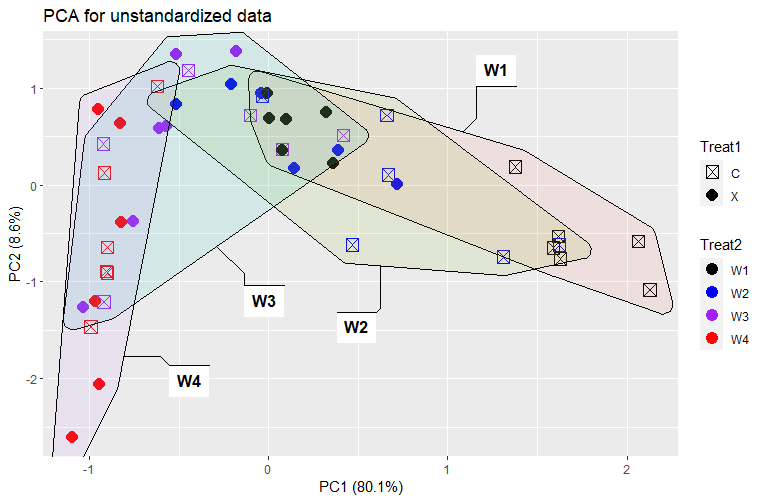

# Statistics-Coursework (Biometry assignments)

This repository contains coursework for an undergraduate statistics/biometry class. It includes the assignment scripts, the raw and cleaned data used for the exercises, example plots produced during the analyses, and final reports.

## What is included

- `Data/` — canonical copies of the datasets used for the assignments:
	- `Behav_Task2.csv` — behavioural data for Assignment 2
	- `Biomdata_Task1.csv` — biometric measurements used in Assignment 1
	- `Soildata_Task3.txt` — soil data used for Assignment 3
	- `Tasks/` — textual descriptions of the tasks and instructions
- `Scripts/` — R scripts that perform the analyses and (when run) produce plots and summary output:
	- `Scripts/Assignment1.R`
	- `Scripts/Assignment2.R`
- `Plots/` — output plots organised by assignment (e.g. `Plots/Assignment1/`, `Plots/Assignment2/`). Open the image/PDF files in those directories to view the figures.
- `Reports/` — final write-ups, if available.

## Analysis summaries — what each assignment does and methods used (example tasks)

- **Assignment 1 — Biometrics** (`Data/Biomdata_Task1.csv`)
	- Aim: Explore biometric/morphological measurements, summarise variation and test differences between groups (for example sexes, treatments or populations). Typical questions are whether measurements differ between groups and how measurements covary.
	- Typical methods used: descriptive statistics (means, SD), exploratory plots (histograms, boxplots, scatterplots), group comparisons using t-tests or one-way ANOVA (or non-parametric equivalents), linear regression (lm) to model relationships between continuous variables, correlation tests (Pearson or Spearman), and simple model diagnostics (residuals, QQ-plots).
	- Typical plots: boxplots by group, scatterplots with smoothing/regression line, histograms/density plots, residual and QQ-plots for model checks.

- **Assignment 2a — Behavioural** (`Data/Behav_Task2.csv`)
	- Aim: Analyse behavioural measures (for example response times, accuracy rates or counts) to compare conditions, examine learning/changes over time, or test treatment effects.
	- Typical methods used: summary statistics and EDA, visualization (time-series/line plots for repeated measures; boxplots and histograms), hypothesis testing with t-tests or ANOVA for between-group comparisons, non-parametric tests (Wilcoxon) when assumptions fail, generalized linear models (GLMs) for binary/count outcomes, and — if data are repeated measures — mixed-effects models (lme4::lmer / nlme) to account for subject-level variation.
	- Typical plots: line plots for repeated measures, boxplots and violin plots by condition, scatterplots, bar charts with error bars and diagnostic plots for models.

- **Assignment 2b — Soil data** (`Data/Soildata_Task3.txt`)
	- Aim: Describe soil properties and test relationships between soil variables or effects of site/treatment. Questions often include which factors predict a target soil property or whether sites differ in composition.
	- Typical methods used: exploratory summaries, correlation matrices, multivariate techniques (PCA) to summarise structure, regression or ANOVA for testing predictors, and data transformations as needed for skewed variables.
	- Typical plots: scatterplot matrices, PCA biplots, boxplots by site or treatment, and diagnostic plots for regression models.

Example: *Plot6.: Scatterplot for the 2 different treatments effect on coverage of plant species from Assigment2-Task3 (Treatment 2 circled)*

